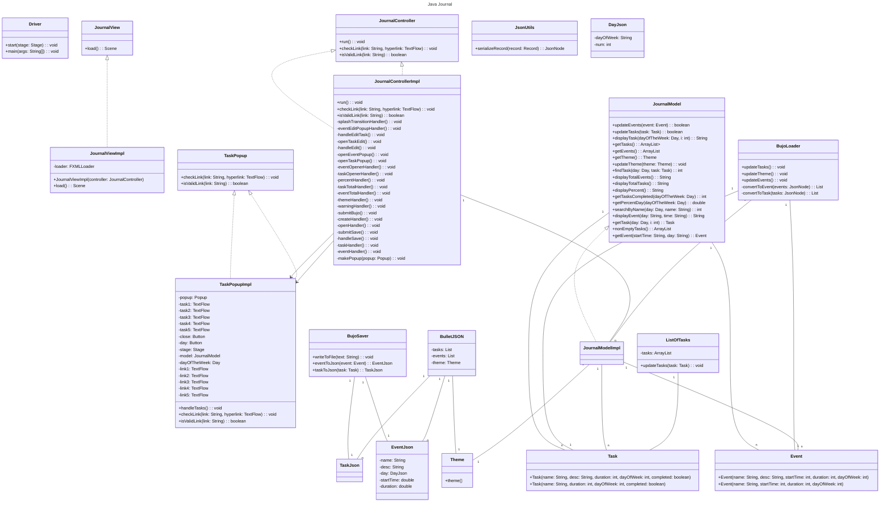

```mermaid
---
title: Java Journal
---
classDiagram
  class Driver {
    +start(stage: Stage): void
    +main(args: String[]): void
  }

  class JournalView {
    +load(): Scene
  }

  class JournalViewImpl {
    -loader: FXMLLoader
    +JournalViewImpl(controller: JournalController)
    +load(): Scene
  }

 JournalView <|.. JournalViewImpl

  class JournalController {
    +run(): void
    +checkLink(link: String, hyperlink: TextFlow): void
    +isValidLink(link: String): boolean
  }

  class JournalControllerImpl {
    +run(): void
    +checkLink(link: String, hyperlink: TextFlow): void
    +isValidLink(link: String): boolean
    -splashTransitionHandler(): void
    -eventEditPopupHandler(): void
    -handleEditTask(): void
    -openTaskEdit(): void
    -handleEdit(): void
    -openEventPopup(): void
    -openTaskPopup(): void
    -eventOpenerHandler(): void
    -taskOpenerHandler(): void
    -percentHandler(): void
    -taskTotalHandler(): void
    -eventTotalHandler(): void
    -themeHandler(): void
    -warningHandler(): void
    -submitBujo(): void
    -createHandler(): void
    -openHandler(): void
    -submitSave(): void
    -handleSave(): void
    -taskHandler(): void
    -eventHandler(): void
    -makePopup(popup: Popup): void
  }

  class TaskPopup {
    +checkLink(link: String, hyperlink: TextFlow): void
    +isValidLink(link: String): boolean
  }

  class TaskPopupImpl {
    +handleTasks(): void
    +checkLink(link: String, hyperlink: TextFlow): void
    +isValidLink(link: String): boolean
    -popup: Popup
    -task1: TextFlow
    -task2: TextFlow
    -task3: TextFlow
    -task4: TextFlow
    -task5: TextFlow
    -close: Button
    -day: Button
    -stage: Stage
    -model: JournalModel
    -dayOfTheWeek: Day
    -link1: TextFlow
    -link2: TextFlow
    -link3: TextFlow
    -link4: TextFlow
    -link5: TextFlow
  }

  JournalController <|.. JournalControllerImpl
  TaskPopup <|.. TaskPopupImpl
  JournalControllerImpl --> TaskPopupImpl

  class JournalModel {
    +updateEvents(event: Event): boolean
    +updateTasks(task: Task): boolean
    +displayTask(dayOfTheWeek: Day, i: int): String
    +getTasks(): ArrayList<ArrayList<Task>>
    +getEvents(): ArrayList<Event>
    +getTheme(): Theme
    +updateTheme(theme: Theme): void
    +findTask(day: Day, task: Task): int
    +displayTotalEvents(): String
    +displayTotalTasks(): String
    +displayPercent(): String
    +getTasksCompleted(dayOfTheWeek: Day): int
    +getPercentDay(dayOfTheWeek: Day): double
    +searchByName(day: Day, name: String): int
    +displayEvent(day: String, time: String): String
    +getTask(day: Day, i: int): Task
    +nonEmptyTasks(): ArrayList<Task>
    +getEvent(startTime: String, day: String): Event
  }

  class Event {
    +Event(name: String, desc: String, startTime: int, duration: int, dayOfWeek: int)
    +Event(name: String, startTime: int, duration: int, dayOfWeek: int)
  }

  class Task {
    +Task(name: String, desc: String, duration: int, dayOfWeek: int, completed: boolean)
    +Task(name: String, duration: int, dayOfWeek: int, completed: boolean)
  }

  class BujoSaver {
    +writeToFile(text: String): void
    +eventToJson(event: Event): EventJson
    +taskToJson(task: Task): TaskJson
  }

  class BujoLoader {
    +updateTasks(): void
    +updateTheme(): void
    +updateEvents(): void
    -convertToEvent(events: JsonNode): List<Event>
    -convertToTask(tasks: JsonNode): List<Task>
  }

  class JsonUtils {
    +serializeRecord(record: Record): JsonNode
  }

  class BulletJSON {
    -tasks: List<TaskJson>
    -events: List<EventJson>
    -theme: Theme
  }

  class DayJson {
    -dayOfWeek: String
    -num: int
  }

  class EventJson {
    -name: String
    -desc: String
    -day: DayJson
    -startTime: double
    -duration: double
  }

  class ListOfTasks {
    -tasks: ArrayList<Task>
    +updateTasks(task: Task): void
  }

  class Theme {
    +theme()
  }
  
  JournalController <|.. JournalControllerImpl
  TaskPopup <|.. TaskPopupImpl
  JournalControllerImpl --> TaskPopupImpl
  JournalModel <|.. JournalModelImpl
  JournalModel "1" -- "n" Event
  JournalModel "1" -- "n" Task
  JournalControllerImpl "1" -- "1" JournalModelImpl
  BujoSaver "1" -- "1" EventJson
  BujoSaver "1" -- "1" TaskJson
  BujoLoader "1" -- "1" Event
  BujoLoader "1" -- "1" Task
  BujoLoader "1" -- "1" JournalModelImpl
  BulletJSON "1" -- "n" TaskJson
  BulletJSON "1" -- "n" EventJson
  BulletJSON "1" -- "1" Theme
  JournalModelImpl "1" -- "n" Event
  JournalModelImpl "1" -- "n" Task
  ListOfTasks "1" -- "n" Task
  JournalModelImpl "1" -- "1" Theme


```
